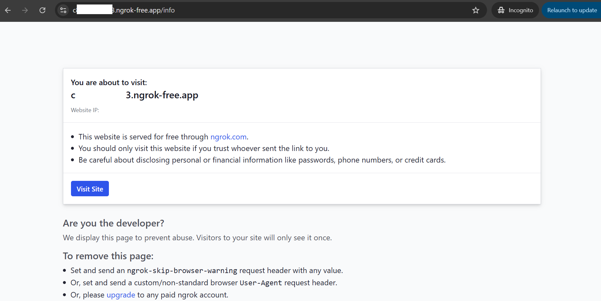

# SnakeWar TypeScript Starter Project

This project is a great starting point for anyone wanting to program their first SnakeWar in TypeScript **(Feel free to choose your own favorite language)**. It can be run locally or easily deployed to a cloud provider of your choosing. 

## Technologies Used

This Template uses [TypeScript](https://www.typescriptlang.org/), [Node.js](https://nodejs.org/en/), and [Express](https://expressjs.com/) as an working sample. **You can use AI to convert it to your favorite programming language**. It also comes with an optional [Dockerfile](https://docs.docker.com/engine/reference/builder/) to help with deployment.

## Run Your SnakeWar

Install dependencies using npm

```sh
npm install
```

Start your SnakeWar

```sh
npm run start
```

You should see the following output once it is running

```sh
Running Battlesnake at http://0.0.0.0:8000
```

Open [localhost:8000](http://localhost:8000) in your browser and you should see

```json
{"apiversion":"1","author":"","color":"#888888","head":"default","tail":"default"}
```

## Play a Game Locally

Build the simulator project

Command to run a local game

```bash
npm install
node index.js --name "My Snake" --url http://localhost:8000
```

## Next Steps

customize and improve your Battlesnake's behavior. Try to keep your snake survive in the simulator. 

```js
function move(gameState: GameState): MoveResponse {
    //YOUR LOGIC HERE
}
```

**Note:** you'll need to deploy your Battlesnake to a live web server OR use a port forwarding tool like [ngrok](https://ngrok.com/) to access your server locally.

**Known Issue:** 
- If you use ngrok to expose your server, ask admin to browse your link and click on **visit site** button to access your ngrok server
- If you plan to expose your snake via ngrok, **be aware that ngrok have quota limit for free usage** so plan with your teammate accordingly about the strategy to use it properly **(a quick strategy here is each member from a team apply for a free trial ngrok key so we will have 2 key per team)**



## Before joining the real snake war
- Read the [Game-Rules](./docs/game-rules.md)
- Set your team name via info endpoint and customize your snake [Customization](./docs/customization.md)
- Example Response From Server [example-move](./docs/example-move.md)
